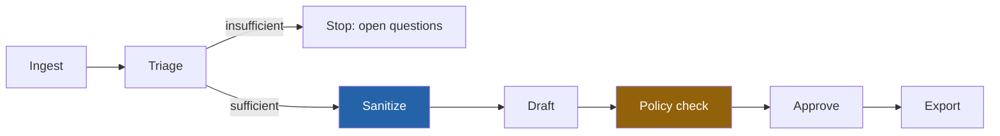

# Gatekeeper

*Built by Kiran Babu Ganesha.*

Gatekeeper takes an internal engineering ticket and turns it into four audience-specific customer communications, without ever letting the drafting model see the raw ticket.

## The architectural claim

The drafting model receives only `SanitizedFacts` — a redacted, structured summary — never the raw `SourceArtifact`. This isn't a prompt instruction, it's a type the raw ticket doesn't fit, and it's checked at build time, not just trusted at runtime:

```ts
// lib/pipeline/draft.ts — the only inputs this function can accept
export async function draft(
  facts: SanitizedFacts,           // never SourceArtifact
  audience: VariantAudience,
  messageType: TriageResult["messageType"]
): Promise<Variant> { /* ... */ }
```

```ts
// lib/pipeline/__tests__/boundary.test.ts
it("draft.ts never references the raw ticket type", () => {
  const source = fs.readFileSync("lib/pipeline/draft.ts", "utf-8");
  expect(source).not.toMatch(/SourceArtifact/);
});
```

An ESLint rule backs the same guarantee — referencing the raw ticket type inside `draft.ts` or `policy-check.ts` is a lint error, not just a failed test. "The LLM checked it" isn't an answer a legal team accepts; a boundary a prompt could quietly bypass isn't a boundary.

## Eval results

| Metric | Result | Gate |
|---|---|---|
| Block-severity recall | 100% | ≥ 98% |
| Sanitization recall | 100% | 100% |
| Golden-set examples passing | 24 / 24 | — |

Run it yourself: `pnpm eval`. These numbers come from a self-authored golden set (24 examples, same author as the detectors) — see [What this is not](#what-this-is-not).

## Pipeline



Only `sanitize()` (and the ingest/triage stages ahead of it) ever touch a `SourceArtifact`. Everything from `draft()` onward operates on `SanitizedFacts` and rendered text.

## Quickstart

```bash
pnpm install
pnpm db:push && pnpm seed
pnpm dev   # http://localhost:3100
```

No API key required — every LLM call is routed through deterministic stubs by default (`GATEKEEPER_USE_STUB_LLM=true`). Set `ANTHROPIC_API_KEY` and flip that flag to `false` in `.env.local` to use real Claude calls instead; no caller code changes, since every call goes through one seam ([lib/llm.ts](lib/llm.ts)).

## Importing tickets from Jira

Gatekeeper can pull real Jira tickets through [Keyhouse](https://github.com/KiranBabu729/keyhouse), which handles the OAuth and keeps the Jira tokens. Gatekeeper's Keyhouse application runs in proxy mode, so Gatekeeper never holds a Jira token; one organization-owned connection serves everyone.

1. In Keyhouse, set up Jira on the Providers page, then create an application with access mode **proxy**, return URL `http://localhost:3100/`, and a test SDK key.
2. Set `KEYHOUSE_BASE_URL`, `KEYHOUSE_SECRET_KEY` and `GATEKEEPER_BASE_URL` in `.env.local` (see `.env.example`) and restart Gatekeeper.
3. On the Tickets page, choose **Connect Jira**, then search.

The search box needs no model. A ticket key (`ACME-123`) or Jira link imports that ticket straight away; anything else is a keyword search that also understands `project:`, `status:`, `is:open` / `is:done`, `type:`, `label:`, `component:` and `updated:7d`, and lists up to 10 matches to pick from.

Imported tickets enter the same pipeline as fixtures: only `sanitize()` reads the raw ticket. Jira issue types map onto Gatekeeper's: Bug → bugfix; Story, Feature, Improvement, Epic → feature; Incident → incident; anything else → maintenance. The labels `security`, `breaking-change`, `deprecation` and `incident` take precedence over the Jira type.

## What this is not

This is a weekend prototype, not a production system:

- Jira is the only live tracker (through Keyhouse); Linear tickets still arrive by paste.
- Single-tenant, SQLite, no auth — a user-switcher stands in for real roles.
- The 12 claims-rule detectors are deterministic pattern matchers standing in for what would be LLM classifier calls in production. They catch the adversarial phrasings in this repo's own golden set; a real classifier would also catch phrasing regex structurally cannot, and a golden set built by someone other than the detector's author would be a stronger signal than the 100% above.
- 2 risk tiers (`standard` / `requires_legal`), not the full range a real policy team would want.

## License

Gatekeeper was designed and built by **Kiran Babu Ganesha**.

It's open source under the [Apache License 2.0](LICENSE): use it, change it, ship it, commercially or not. The one thing I ask for, and the license requires, is credit: if you redistribute Gatekeeper or anything built from it, keep the copyright line and include the [NOTICE](NOTICE) file. If you use it in your work, a mention is appreciated. [CITATION.cff](CITATION.cff) has the details.
