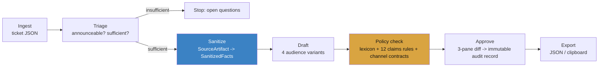

# Gatekeeper

A compliance layer for outbound product communications. Product teams write customer-facing messages from internal tickets, and those messages routinely leak sensitive detail or contain claims that create legal exposure. Gatekeeper takes an internal ticket, strips what must never leave the building, drafts four audience-specific messages, checks each against a versioned policy, and routes it for approval with a full audit record.

## The claim that matters

**The drafting model never sees the raw ticket.** `draft()` and `checkPolicy()` are typed to accept only `SanitizedFacts` / rendered `Variant` text — there is no code path from a `SourceArtifact` to either function except through `sanitize()`. This isn't a convention, it's enforced three ways:

1. **Types** — `SanitizedFacts` and `SourceArtifact` share no fields; you cannot structurally pass one where the other is expected.
2. **Lint** — an ESLint override ([eslint.config.mjs](eslint.config.mjs)) turns any reference to the raw-ticket type inside [lib/pipeline/draft.ts](lib/pipeline/draft.ts) or [lib/pipeline/policy-check.ts](lib/pipeline/policy-check.ts) into a build error.
3. **Test** — [lib/pipeline/__tests__/boundary.test.ts](lib/pipeline/__tests__/boundary.test.ts) greps those two files' source and fails if the identifier appears anywhere, including comments.

"The LLM checked it" isn't an answer a legal team accepts — a compliance boundary that a prompt could quietly bypass isn't a boundary. This one can't be bypassed without a failing test.

## Pipeline



Only `sanitize()` (and the ingest/triage stages that precede it) ever touch a `SourceArtifact`. Everything from `draft()` onward operates on `SanitizedFacts` and rendered text.

## Eval harness

Route: `/evals`. A golden set of 24 labeled examples ([evals/golden-set.json](evals/golden-set.json)) covers all 12 claims rules (core cases + 6 adversarial phrasings designed to evade a naive detector) plus 4 sanitization cases and 2 negative controls. The runner ([evals/runner.ts](evals/runner.ts)) computes per-rule precision/recall and gates on:

- **Block-severity recall ≥ 98%**
- **Sanitization recall = 100%**

Current numbers: **100% block recall, 100% sanitization recall, 24/24 passing.** Run it yourself:

```bash
pnpm eval
```

## Policy as code

[policy/policy.yaml](policy/policy.yaml) is versioned (`policy/policy.v1.yaml` is the prior version, diffed on the `/policy` page). Every rule carries `tests.positive` / `tests.negative`, and rules are **scoped by audience with per-audience severity overrides** — `FWD-01` (dated forward-looking commitments) blocks on `customer_email` and `marketing` but downgrades to `advise` on `internal_brief`, because "we're exploring this for Q4" is a fine thing to tell your own support team and a legal problem to tell a customer. The `/policy` page includes an **impact preview**: paste a candidate policy and see which previously approved messages would now fail.

## Stack

Next.js 15 (App Router) · TypeScript strict · Tailwind v4 · SQLite via Prisma · Zod at every stage boundary · Anthropic SDK behind a single stub-or-real seam ([lib/llm.ts](lib/llm.ts)) · Vitest · no auth (a user-switcher in the header stands in for Author / Legal Reviewer roles).

## Running it

```bash
pnpm install
pnpm db:push      # creates dev.db from prisma/schema.prisma
pnpm seed         # runs the 8 fixture tickets through the pipeline
pnpm dev          # http://localhost:3000
```

By default every LLM call (`GATEKEEPER_USE_STUB_LLM=true` in `.env.local`) runs through deterministic stubs — no API key needed, and it's why the fixtures and eval harness produce the same numbers every run. To use real Claude calls for triage / sanitize / draft, put a key in `ANTHROPIC_API_KEY` and set `GATEKEEPER_USE_STUB_LLM=false`; no caller code changes, since every call goes through `callStructuredLLM()`.

```bash
pnpm test         # unit tests for the deterministic layers (redactors, channel contracts, policy check)
pnpm eval         # golden-set gate, CI-style output, non-zero exit on failure
pnpm lint
```

## Routes

| Route | What it shows |
|---|---|
| `/` | Ticket picker — 8 fixtures + paste-JSON |
| `/process/[id]` | The pipeline as an inspectable stepper (raw JSON at every stage) |
| `/process/[id]/review` | 3-pane diff, inline findings, override + approve |
| `/policy` | Policy viewer, version diff, impact preview |
| `/audit` | Immutable audit records |
| `/evals` | The eval harness |

## What's a stub and what's real

This is a weekend-scoped build, not the 6-month version. Cut deliberately: OAuth ticket connectors (seeded fixtures + paste-JSON instead), Postgres/multi-tenancy (SQLite, single tenant), a 500-example golden set (24, but covering every rule), 4 risk tiers (2: `standard` / `requires_legal`). Kept, because they're the point: the sanitize boundary, claims-level policy with audience scoping, policy-as-code with versions and an impact preview, inline findings with character spans, the 3-pane diff, the immutable audit record, and the eval harness with a recall gate.

The 12 claims-rule detectors ([lib/pipeline/claims-rules.ts](lib/pipeline/claims-rules.ts)) are deterministic pattern matchers standing in for what would be LLM classifier calls in production — same interface (`text -> matches`), so swapping one for a real model call touches one function, not its callers. A real classifier would also catch adversarial phrasing regex structurally cannot (e.g. a claim implied rather than stated); that's a known, documented gap here, not a hidden one.
